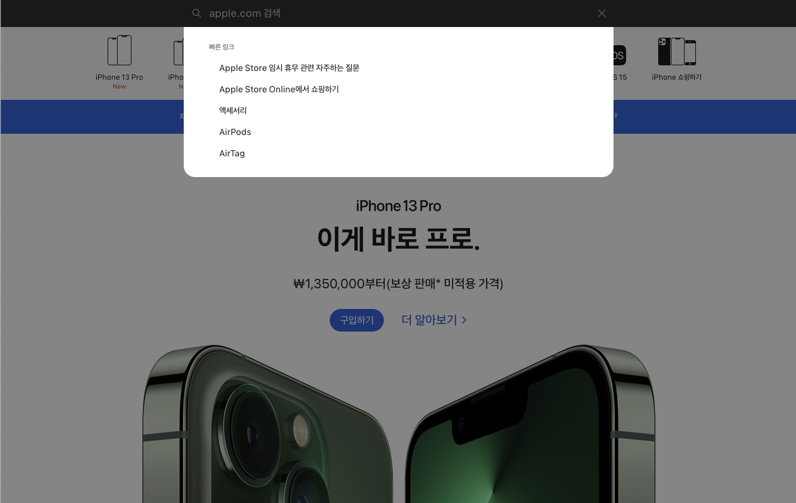

# Modal

## Modal 이란?

Modal은 페이지 내의 다른 기능을 정지 시키고 사용자와 소통하는 창이다.
이때 Modal 외엔 사용할 수 없음을 표시하기 위해, 화면 나머지를 투명한 필터를 씌운다.
예를 들어서 애플 홈페이지의 검색창을 보자.
검색 버튼을 누르면 화면 스크롤 기능이 막히고 검색 Modal이 나타난다.
이때 Modal 외부를 누르면 Modal이 사라지고 본래 화면이 나온다.



이미 웹에서 Modal을 많이 접해봤을 것이다.
Modal은 다음 진행을 위한 통과처로 종종 사용된다.
그래서 Modal 내부의 선택지를 골라야 닫히거나, 밖을 선택해서 취소할 수 있도록 만들어졌다.
Modal의 핵심 사항은 아래와 같다.

-   버튼을 누르면 Modal이 열릴 것
-   Modal 외부에 필터를 씌울 것
-   Modal 외부를 누르면 Modal 이 닫힐 것
-   Modal 내부의 선택지를 고르면 Modal이 닫힐 것

위 사항에 유의하면서 React를 사용해서 Modal을 만들어보겠다.

## React로 Modal 만들기

### Modal Style

Modal을 만들 때 필요한 컴포넌트는 3가지다.
화면에 필터를 씌울 때 사용할 ModalOverlay, Modal 창을 포함할 ModalContainer, Modal 창을 구현할 ModalWindow.

ModalOverlay는 visible이란 state의 값에 따라서 보이거나 보이지 않아야 한다.
그러므로 visible 값에 따라서 display를 block이나 none으로 바꿔줘야 한다.
전체 화면을 덮어야 하므로 position을 fixed로 만들고 top, left, width, height 값을 정해줬다.
그리고 z-indes를 충분히 크게 줘서 다른 내용보다 앞에 오도록 만들었다.
이때 height이 잘 적용되지 않는 경우가 있다.
이는 html, body, #root 등의 높이가 정해지지 않아서 생기는 문제다.
아래처럼 GlobalStyle에서 Modal까지의 컴포넌트의 height을 지정하면 해결된다.
Modal의 위치에 따라서 지정 해야 할 태그는 바뀔 수 있다.

```javascript
html,
body,
body > #root,
body > #root > div {
	height: 100%;
}
```

ModalContainer 역시 visible 값에 따라 display가 바뀌어야 한다.
그리고 ModalContainer가 ModalOverlay 보다 앞에 있어야 하므로 z-index를 더 크게 해준다.
마지막으로 ModalWindow를 중앙에 표시하기 위해 position, top, left, transform 값을 지정해준다.
아래는 styled component를 사용해서 셋을 만든 것이다.

```javascript
import styled from "styled-components";

const ModalOverlay = styled.div`
	box-sizing: border-box;
	position: fixed;
	top: 0px;
	left: 0px;
	width: 100%;
	height: 100%;
	display: ${(props) => (props.visible ? "block" : "none")};
	background-color: rgba(0, 0, 0, 0.4);
	z-index: 999;
`;

const ModalContainer = styled.div`
	box-sizing: border-box;
	display: ${(props) => (props.visible ? "block" : "none")};
	position: fixed;
	top: 0px;
	left: 0px;
	width: 100%;
	height: 100%;
	z-index: 1000;
`;

const ModalWindow = styled.div`
	position: relative;
	box-sizing: border-box;
	box-shadow: 0px 0px 12px 8px rbga(0, 0, 0, 0.4);
	border-radius: 8px;
	width: 480px;
	max-width: 480px;
	height: 320px;
	top: 50%;
	left: 50%;
	transform: translateY(-50%) translateX(-50%);
	padding: 32px 16px;
	background-color: white;
`;
```

위 컴포넌트로 Modal을 만들면 아래처럼 된다.

```javascript
function Modal({ visible, children }) {
	return (
		<>
			<ModalOverlay visible={visible}>
			<ModalContainer visible={visible} tabIndex={-1}>
				<ModalWindow tabIndex={0}>
					{children}
				</ModalWindow>
			</ModalContainer>
		</>
	)
}
```

여기서 tabIndex는 대상이 포커스 가능한지, tab으로 선택하는 순서를 정한다.
tabIndex가 음수면 tab키로는 선택되지 않지만, 마우스 클릭은 가능한 상태다.
ModalContainer는 클릭하면 Modal이 종료되는 기능을 추가할 예정이므로 -1로 지정해줬다.
ModalWindow는 tab키로 선택할 수 있도록 0을 줬다.
[^tabindex]

### Modal visibility

이번에는 Modal의 visible을 조절해보겠다.
우선 버튼을 눌렀을 때 Modal 창이 보이도록 만들어주려고 한다.
이는 onClick 함수로 간단하게 해결할 수 있다.

```javascript
function App() {
	const [visible, setVisible] = useState(false);

	const showModal = () => {
		setVisible(true);
	};

	return (
		<div>
			<button onClick={showModal}>Show Modal</button>
			{visible && <Modal visible={visible}>This is Modal contents</Modal>}
		</div>
	);
}
```

이제 Modal 창이 보일때 화면을 숨길 방법을 알아보자.
Modal은 Modal 외부를 눌렀을 때 종료되거나, 종료 버튼을 누르면 꺼저야 한다.
종료 버튼을 누르면 사라지는 것은 간단하게 버튼으로 해결할 수 있다.

```javascript
function App() {
	...
	const hideModal = () => {
		setVisible(false);
	}
	return (
		<div>
			<button onClick={showModal}>Show Modal</button>
			{
				visible &&
				<Modal visible={visible}>
					<button onClick={hideModal}>Hide Modal</button>
					This is Modal contents
				</Modal>
			}
		</div>
	);
}
```

또한 Modal은 Modal 외부를 눌렀을 때 꺼져야 한다.
다시 말해 ModalContainer를 눌렀을 때 종료되어야 한다.
이를 위해서 ModalContainer에 onClick event를 추가해줘야 한다.
이때 setVisible이 필요하므로 props로 가져와야 한다.
현재 코드는 간단하기 때문에 props로 전달해줬지만, 복잡해지면 Recoil이나 Redux를 사용하는 것이 좋다.

```javascript
function Modal({ visible, children, setVisible }) {
	const clickOutside = (event) => {
		setVisible(false);
	};
	return (
		<>
			<ModalOverlay visible={visible}>
			<ModalContainer visible={visible} tabIndex={-1} onClick={clickOutside}>
				<ModalWindow tabIndex={0}>
					{children}
				</ModalWindow>
			</ModalContainer>
		</>
	)
}
```

그런데 위처럼 작성하면 \<ModalWindow>를 눌렀을 때도 종료된다.
우리는 외부를 눌렀을 때만 종료되도록 만들고 싶으므로 조건을 추가해줘야 한다.
그러기 위해선 event.target과 event.currentTarget의 차이를 알아야 한다.
event.target은 event가 붙어있는 대상이 출력되고, event.currentTarget은 현재 누른 컴포넌트가 출력된다.
아래처럼 console.log로 콘솔에 출력되도록 만들고 Modal 내부와 외부를 눌러보자.

```javascript
function Modal({ visible, children, setVisible }) {
	const clickOutside = (event) => {
		console.log(event.target);
		console.log(event.currentTarget);
	};
	...
}
```

event.target은 어디를 눌러도 \<ModalContainer>이 나온다.
반면 event.currentTarget은 현재 누른 대상을 보여준다.
그러므로 ModlaWindow를 누르면 \<ModalWindow>가 출력되고 외부를 누르면 \<ModalContainer>가 출력된다.
이를 이용해서 \<ModalWindow>를 누르면 종료되지 않고, 밖을 눌렀을 때만 종료되도록 만들 수 있다.

```javascript
function Modal({ visible, children, setVisible }) {
	const clickOutside = (event) => {
		if (event.target === event.currentTarget) {
			setVisible(false);
		}
	};
	...
}
```

### Prevent Scroll

현재 Modal은 스크롤 기능을 막지 않았다.
그러므로 Modal이 보이더라도 스크롤이 가능하다.
하지만 Modal은 현재 선택지만 집중하도록 하는 기능이므로 스크롤을 막아야 한다.
이는 useEffect를 사용해서 overflow 값을 조정하는 것으로 해결할 수 있다.

```javascript
function Modal({ visible, children, setVisible }) {
	...
	useEffect(() => {
		if (visible) {
			document.body.style.overflow = "hidden";
		}
		return () => {
			document.body.style.overflow = "";
		};
	}, [visible]);
}
```

## Reference

-   [효율적인 리액트 모달 만들기](https://medium.com/@bestseob93/%ED%9A%A8%EC%9C%A8%EC%A0%81%EC%9D%B8-%EB%A6%AC%EC%95%A1%ED%8A%B8-%EB%AA%A8%EB%8B%AC-react-modal-%EB%A7%8C%EB%93%A4%EA%B8%B0-bd003458e9d)

[^tabindex]: tabindex는 가급적 0보다 큰 수를 사용하지 않는 것이 좋다. tab 키를 누르면 tabindex가 작은 순서대로 초점이 옮겨진다. 이때 tabindex 값으로 순서를 조절하면 tab으로 옮기는 순서와 시각적 순서가 맞지 않아서 혼란이 생긴다.
