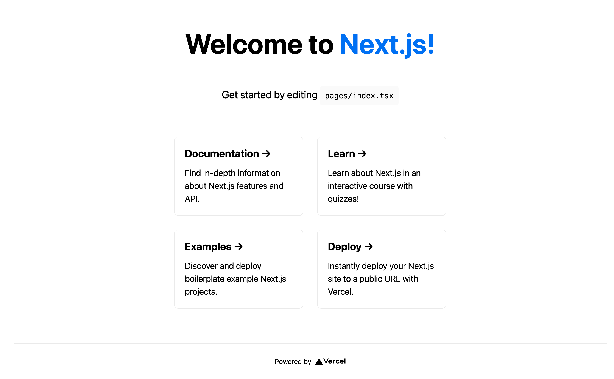
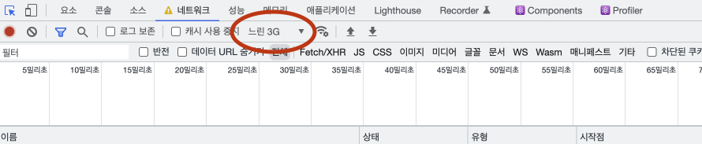

# Next.js

## Create Next.js Project

Next.js 프로젝트를 시작하기 위해서 create-next-app을 사용한다.
`npx create-next-app@latest`로 프로젝트를 만들 수 있다.
타입스크립트를 사용하려면 뒤에 --typescript를 붙여서 `npx create-next-app@latest --typescript`로 적어주면 된다.
create-next-app을 실행시키면 프로젝트 이름을 입력해줘야 한다.
나는 nextjs-test로 만들어줬다.
그리고 프로젝트 폴더를 VSCode에서 열어준다.
터미널에서 `npm run dev`을 입력해서 프로젝트가 정상적으로 작동하는지 확인한다.



이제 폴더에서 필요 없는 파일을 삭제한다.
pages의 api 폴더는 필요 없으므로 지워준다.
그리고 index.tsx 파일을 아래처럼 바꾸고 페이지를 보면, 홈 화면에 Hello가 출력된 것을 볼 수 있다.

```javascript
// index.tsx
export default function Home() {
	return "Hello";
}
```

## Overview

### Pre-Rendering and Client-Side-Rendering

Next.js와 React의 가장 큰 차이점은 Pre-Rendering이 된다는 것이다.
Pre-Rendering은 클라이언트에게 전달되기 전에 미리 랜더링 하는 것이다.
왜 pre-rendering이 필요한지 알기 위해 React의 랜더링 시스템을 알아보자.

React로 만든 웹 페이지를 접속해면 처음엔 흰색 화면이 나오고 랜더링이 일어난다.
이는 React가 기본적으로 빈 HTML으로 시작해서, 자바스크립트 파일로 컴포넌트를 만들기 때문에 발생한다.
이처럼 자바스크립트 파일로 UI를 만드는 것은 클라이언트에서 일어나기 때문에 이를 **client-side-rendering**이라고 한다.

client-side-rendering은 자바스크립트로 컴포넌트를 만든다.
그렇기 때문에 자바스크립트 실행을 막으면 아무런 페이지도 보이지 않는다.
물론 자바스크립트 실행을 막는 경우는 거의 없으므로 별 문제 없으리라 생각할 수 있다.
그런데 네트워크 속도가 느리면 생각보다 큰 문제가 될 수 있다.
크롬에서 개발자 도구를 열고, 네트워크에 들어가자.
그리고 네트워크를 느린 3G로 바꾸고 다시 페이지를 켜보자.



네트워크가 느리면 자바스크립트 파일을 가져오는데 오랜 시간이 걸린다.
그래서 사용자가 빈 화면을 오래 봐야 하고, 사용 경험에 부정적인 영향을 줄 수밖에 없다.

반면 Next.js는 **pre-rendering**을 한다.
pre-rendering은 클라이언트 측에서 자바스크립트로 모두 만드는 대신에, 서버에서 HTML을 만들어서 전달한다.
그래서 client-side-rendering과는 달리 기본적인 HTML 구조를 볼 수 있다.
대신에 자바스크립트 파일이 다 불러와지기 전에 자바스크립트를 사용하는 기능은 쓸 수 없다.
그래서 HTML은 존재하지만 interactive 하지 않은 상태로 시작하고, 자바스크립트 파일을 불러오면 interactive 해진다.

pre-rendering의 또 다른 장점은 SEO(Search Engine Optimization)가 유리하다는 것이다.
구글 검색엔진은 자바스크립트가 로드 되지 않은 페이지를 스캔한다.
앞서 말했듯이 client side rendering은 초기에 빈 화면만 존재하므로, 아무런 검색에 걸리지 않는다.
이는 react-helmet 등을 사용해서 해결할 순 있지만 번거롭다.
반면 pre-rendering을 하면 기본적인 HTML이 존재하므로 SEO에 유리하다.

pre-rendering은 server-side rendering, static site generation 두 종류로 나뉜다.
server-side rendering은 각 페이지 요청마다 서버에서 HTML을 만든다.
그리고 만들어진 HTML과 JSON, 자바스크립트 파일을 클라이언트에게 보내서 나머지를 만들게 한다.
이렇게 하면 클라이언트는 interactive하지 않은 HTML 페이지를 먼저 보게 된다.
그리고 React가 JSON과 자바스크립트로 해당 페이지를 interactive하게 만드는데, 이 과정을 **hydration**이라고 한다.
다시 말해 hydration은 HTML 코드와 자바스크립트 코드를 연결시켜서 페이지를 interactive하게 만드는 것이다.

static site generation 역시 서버에서 HTML을 만든다.
그렇지만 server-side rendering과는 다르게 runtime에 쓰일 서버가 없다.
그 대신에 어플리케이션이 배포되는 build time에 모든 페이지의 HTML을 만든다.
그리고 HTML은 CDN(Content Delivery Network)에 저장되어서 각 요청마다 사용된다.
SSR은 각 페이지를 요청 받은 시점에 HTML을 만드는 반면, SSG는 미리 페이지를 만들어두므로 더 빠르다.
대신에 SSG는 컨텐츠 변경이 생길 때마다 새로 빌딩해야 하므로 변경 사항이 많은 페이지에 적용하기 어렵다.
그러므로 블로그 같이 고정된 페이지는 SSG로 만들지만, 실시간 정보가 반영되는 사이트는 SSR로 만드는 것이 좋다.

지금까지 설명을 보면 pre rendering이 client side rendering보다 우월해보인다.
하지만 상황에 따라서 위 방법들을 섞어 쓰는 것이 가장 좋다.
데이터 업데이트가 많은 페이지는 처음에는 SSR로 하되 나머지 페이지는 CSR을 사용하면 좀 더 효과적일 것이다.
반대로 블로그, 상품 판매 페이지처럼 변화가 적은 페이지는 SSG를 사용하는 것이 좋다.
Next.js의 장점은 위처럼 선택지가 많고 그 중에서 가장 적절한 방법을 택할 수 있다는 것이다.

### pages

Next.js는 프레임워크이므로 정해진 위치에 코드를 작성하면 알아서 작동한다.
앞서 index.tsx를 보면 일반적인 리액트 파일과 다르게 ReactDOM.render() 없이도 페이지를 만들고 있다.
이것이 프레임워크의 힘으로 양식을 따라 만들기만 하면 번거로운 과정 없이도 페이지를 만들 수 있다.

Next.js의 또 다른 장점은 라우터를 별도로 만들 필요가 없다는 것이다.
Next.js에선 pages에 작성한 파일명이 곧 라우터 이름이 된다.
그리고 해당 파일에서 export default로 내보내는 것이 페이지의 내용이 된다.
예를 들어 about.tsx 파일을 아래처럼 만들면 /about 페이지가 만들어진다.

```javascript
// about.tsx
export default function About() {
	return "about";
}
```

### Navigation

a 태그를 사용해서 네비게이션 기능을 만들면 페이지 이동시마다 새로 랜더링이 일어난다.
React는 이 문제를 해결하기 위해 react router dom의 Link 컴포넌트를 사용했다.
Link는 주소만 바꾸고 페이지를 새로고침 하지 않는다.
그래서 React의 state와 컴포넌트가 그대로 유지되고, 바뀐 것만 업데이트 해준다.

Next.js는 역시 **Link**라는 동명의 컴포넌트를 사용한다.
다만 Next.js에서는 Link 컴포넌트 안에 a 태그로 링크를 만들어줘야 한다.
이때 링크로 이동하게 될 주소는 a가 아니라 Link에 적어줘야 한다.

```javascript
// components/Navbar.tsx
import Link from "next/link";

export default function Navbar() {
	return (
		<nav>
			<Link href="/">
				<a>Home</a>
			</Link>
			<Link href="/about">
				<a>About</a>
			</Link>
		</nav>
	);
}
```

```javascript
// index.tsx
import Navbar from "../components/Navbar";
export default function Home() {
	return (
		<>
			<Navbar />
			Home
		</>
	);
}
```

이때 Link는 랜더링 후에 사라진다.
그러므로 스타일을 적용하고 싶으면 Link가 아니라 a 태그에 적용해야 한다.

```javascript
// Navbar.tsx
import Link from "next/link";

export default function Navbar() {
	return (
		<nav>
			<Link href="/">
				<a style={{ color: "red" }}>Home</a> // This style applied to a.
			</Link>
			<Link href="/about" style={{ color: "blue" }}>
				{" "}
				// This style doesn't work.
				<a>About</a>
			</Link>
		</nav>
	);
}
```

추가로 현재 위치를 알기 위해서 useRouter를 쓸 수 있다.
아래처럼 useRouter를 받아와서 값을 출력해보자.

```javascript
// Navbar.tsx
import Link from "next/link";
import { useRouter } from "next/router";

export default function Navbar() {
	const router = useRouter();
	console.log(router);
	/*
        {
            "pathname": "/about",
            "route": "/about",
            "query": {},
            "asPath": "/about",
            ...
        }
    */
	return (
		<nav>
			<Link href="/">
				<a style={{ color: "red" }}>Home</a>
			</Link>
			<Link href="/about" style={{ color: "blue" }}>
				<a>About</a>
			</Link>
		</nav>
	);
}
```

출력된 결과를 보면 pathname에 현재 위치가 적혀있다.
이를 사용해서 현재 위치의 색만 바꿔주는 것도 가능하다.

```javascript
// Navbar.tsx
export default function Navbar() {
	const router = useRouter();
	return (
		<nav>
			<Link href="/">
				<a style={{ color: router.pathname === "/" ? "red" : "black" }}>Home</a>
			</Link>
			<Link href="/about" style={{ color: "blue" }}>
				<a
					style={{
						color: router.pathname === "/about" ? "red" : "black",
					}}
				>
					About
				</a>
			</Link>
		</nav>
	);
}
```

### CSS Modules

CSS를 적용하려면 여러가지 방법이 있다.
그 중에서 하나인 CSS 모듈을 소개하겠다.
CSS 모듈을 사용하려면 fileName.module.css 파일을 만들어준다.
그리고 styles로 파일을 import 해주면, styles의 속성에 스타일 이름이 들어있다.
이를 className에 사용해서 스타일을 적용할 수 있다.

```javascript
// Navbar.module.css
.active {
	color: red;
}
```

```javascript
// Navbar.tsx
import Link from "next/link";
import { useRouter } from "next/router";
import styles from "./Navbar.module.css";

export default function Navbar() {
	const router = useRouter();
	return (
		<nav>
			<Link href="/">
				<a className={router.pathname === "/" ? styles.active : ""}>Home</a>
			</Link>
			<Link href="/about" style={{ color: "blue" }}>
				<a className={router.pathname === "/about" ? styles.active : ""}>
					About
				</a>
			</Link>
		</nav>
	);
}
```

브라우저에서 만들어진 DOM의 class를 확인해보자.
그러면 "Navbar_active\_\_5L8wg" 같은 랜덤한 이름이 생성된 것을 볼 수 있다.
이는 CSS Module의 장점으로 스타일 중복을 막는 기능이다.
기본적인 CSS는 스타일 이름이 겹치면 여러 스타일이 적용되는 단점이 있다.
그 때문에 각 스타일 이름을 서로 겹치지 않게 만들어야 한다.
반면 CSS Module은 스타일 이름을 구분하기 위해, 개별적인 문자열을 추가한다.
그 덕분에 같은 스타일을 작성하더라도 서로 다른 이름으로 적용되고 중복될 걱정이 없다.

한 번에 여러 CSS Module을 적용하려면 여러 스타일 이름을 string으로 전달해야 한다.
간편한 방법은 백틱(`)을 사용하거나, 배열에 join() 함수를 사용하는 방법이 있다.

```javascript
// Navbar.module.css
.link {
	text-decoration: none;
}

.active {
	color: red;
}

```

```javascript
// Navbar.tsx
export default function Navbar() {
	const router = useRouter();
	return (
		<nav>
			<Link href="/">
				<a
					className={`${styles.link} ${
						router.pathname === "/" ? styles.active : ""
					}`}
				>
					Home
				</a>
			</Link>
			<Link href="/about" style={{ color: "blue" }}>
				<a
					className={[
						styles.link,
						router.pathname === "/about" ? styles.active : "",
					].join(" ")}
				>
					About
				</a>
			</Link>
		</nav>
	);
}
```

중복을 제거해준다는 점에서 유용하지만, 여전히 불편한 점이 많은 방식이다.
여전히 클래스명을 기억해가며 두 파일을 오가야 하고, 여러 스타일을 적용하는 것이 쉽지 않다.
사실 React에서 이미 비슷한 기능을 봤었는데, 그 때도 같은 이유로 이 방법을 사용하지 않았다.
그러므로 다른 CSS를 적용하는 방법을 알아보자.

### Styled JSX

Styled JSX는 자바스크립트로 CSS를 작성하는 라이브러리로, Next.js에 기본적으로 탑재되어 있다.
Styled JSX를 사용하는 법은 간단한데, jsx라는 속성이 붙은 style 태그 안에 css를 작성하면 된다.
이때 css는 태그 내부에 중괄호({})와 백틱(`)을 사용해서 적어준다.
예시로 앞의 코드를 style 태그로 변경시키면 아래처럼 된다.

```javascript
// Navbar.tsx
export default function Navbar() {
	const router = useRouter();
	return (
		<>
			<nav>
				<Link href="/">
					<a className={`link ${router.pathname === "/" ? "active" : ""}`}>
						Home
					</a>
				</Link>
				<Link href="/about" style={{ color: "blue" }}>
					<a
						className={[
							"link",
							router.pathname === "/about" ? "active" : "",
						].join()}
					>
						About
					</a>
				</Link>
			</nav>
			<style jsx>
				{`
					.link {
						text-decoration: none;
					}

					.active {
						color: red;
					}
				`}
			</style>
		</>
	);
}
```

styled jsx는 CSS Module 처럼 독립된 스타일을 만들어준다.
그래서 각 컴포넌트에서 만든 스타일이 다른 스타일에 적용되지 않는다.
예를 들어서 index.tsx에서 a 태그의 색을 바꿔주는 코드를 만들어도, 하위 컴포넌트인 Navbar에 적용되지 않는다.

```javascript
// index.tsx
export default function Home() {
	return (
		<>
			<Navbar />
			Home
			<style jsx>
				{`
					a {
						color: green;
					}
				`}
			</style>
		</>
	);
}
```

독립된 스타일을 만드는 것은 좋지만, 하위 컴포넌트에 스타일이 적용되지 않으므로 global 스타일을 만들 수 없다.
다시 말해 각 컴포넌트가 공통적으로 적용될 스타일을 만들 수가 없다.
global style을 만들려면 global 속성을 사용하면 된다.
style 태그에 global 속성을 추가해서 아래처럼 만들자.

```javascript
// index.tsx
export default function Home() {
	return (
		<>
			...
			<style jsx global>
				{`
					a {
						color: green;
					}
				`}
			</style>
		</>
	);
}
```

이제 홈에서 링크를 보면 초록색이 된 것을 볼 수 있다.
문제는 이 스타일 적용이 홈에서만 되고 about 페이지에선 되지 않는다는 것이다.
이는 styled jsx가 각 페이지 별로 적용되기 때문이다.
즉, global style을 만들어도 해당 스타일은 전체 페이지에 적용 되지 않고, 스타일이 작성된 페이지에만 적용된다.

global style을 모든 페이지에 적용하는 방법은 layout을 만드는 것이다.
layout에 global style을 적용하고 이를 각 페이지마다 불러서 사용하면, 일관성 있게 스타일을 적용할 수 있다.
Next.js는 이를 위해 모든 페이지에 layout을 불러오는 기능이 있다.
pages 폴더 안에 \_app.js 파일을 만들면 모든 페이지에 적용되는 layout을 만들 수 있다.
\_app.js 안에는 모든 페이지에 적용될 컴포넌트를 만들게 된다.
이 컴포넌트는 Component, pageProps를 변수로 사용하는데, Component는 각 페이지 컴포넌트이고, pageProps는 그 속성이 된다.
아래처럼 작성하면 지금까지의 페이지가 그대로 보일 것이다.

```javascript
// _app.js
export default function MyApp({ Component, pageProps }) {
	return <Component {...pageProps} />;
}
```

Component는 각 페이지 컴포넌트가 들어간다.
그러므로 위 Component 위치에 \<Home />이나 \<About />이 들어간 것과 동일한 효과를 보인다.
현재 Home과 About이 공통된 Navbar를 사용하고 있다.
반복되는 부분은 \_app.js에 옮겨서 간단하게 사용할 수 있다.

```javascript
// _app.js
import Navbar from "../components/Navbar";

export default function MyApp({ Component, pageProps }) {
	return (
		<>
			<Navbar />
			<Component {...pageProps} />
		</>
	);
}
```

```javascript
// index.tsx
export default function Home() {
	return (
		<>
			Home
			<style jsx global>
				{`
					a {
						color: green;
					}
				`}
			</style>
		</>
	);
}
```

```javascript
// about.tsx
export default function About() {
	return <>About</>;
}
```

마지막으로 \_app.js로 global style을 옮겨주면 모든 페이지에서 스타일을 적용할 수 있다.

```javascript
// _app.js
export default function MyApp({ Component, pageProps }) {
	return (
		<>
			<Navbar />
			<Component {...pageProps} />
			<style jsx global>
				{`
					a {
						color: green;
					}
				`}
			</style>
		</>
	);
}
```

```javascript
// index.tsx
export default function Home() {
	return <>Home</>;
}
```

이제 a 태그 스타일이 홈과 About 페이지에 모두 적용된 것을 볼 수 있다.
\_app.js에 글로벌 스타일을 적용하는 법이 하나 더 있다.
Next.js는 CSS Module을 제외하고 import 하는 것을 허용하지 않는다.
그래서 외부에 css 파일을 만들고 불러올 수 없다.
하지만 \_app.js만은 예외로 불러올 수 있는데, 이 파일 안의 스타일은 모든 페이지에 적용된다.
그러므로 \_app.js에서 불러온 css는 모든 페이지에서 적용되는 global style이 된다.

프로젝트 파일을 보면 styles 폴더 안에 globals.css가 있다.
이 스타일을 모든 페이지에 적용하려면 \_app.js에서 파일을 import 하기만 하면 된다.
이렇게 하면 앞으로 globals.css 안에 작성하는 스타일은 모든 페이지에서 적용된다.

```javascript
// _app.js
import Navbar from "../components/Navbar";
import "../styles/globals.css";

export default function MyApp({ Component, pageProps }) {
	return (
		<>
			<Navbar />
			<Component {...pageProps} />
		</>
	);
}
```

추가적으로 여러 layout을 사용하고 싶다면, layout 파일을 따로 만들어서 사용해주는 것도 좋은 방법이다.

### Head

React에서 head를 수정하려면 React-helmet을 사용해야 했다.
Next.js는 Head 태그로 같은 기능을 사용할 수 있다.
Head 내에 title, meta 등을 입력해주면, 해당 태그가 html의 head 태그 내용으로 변경된다.

### Image

Next.js에서 image를 사용하려면 public 폴더를 이용한다.
public 폴더 내에 이미지를 위치시키면 경로 검색을 하지 않고도 이미지를 사용할 수 있다.
예를 들어서 public 폴더에 "a.jpg" 파일이 있다고 하자.
React에서는 아래처럼 src를 적어줘야 한다.

```
<image src="../public/a.jpg" />
```

Next.js는 이를 아래처럼 사용할 수 있다.

```
<Image src="a.jpg" />
```

여기서 보면 image 대신에 Image를 사용했다.
Image는 Next.js용 이미지 로딩 컴포넌트다.
자세한 설명은 이후에 하기로 하고 일단은 Image 태그를 사용해야 한다는 것만 기억하자.

### Redirects

특정 주소를 요청 받을 때, 다른 페이지로 옮겨주려면 redirect를 사용한다.
redirects는 next.config.js 안에서 사용할 수 있는 비동기 함수다.
아래처럼 async를 사용해서 쓸 수 있다.

```javascript
// next.comfig.js
module.exports = {
	async redirects() {
		return [
			{
				soure: "/about/",
				destination: "/",
				permanent: true,
			},
		];
	},
};
```

redirects는 source, destination, permanent를 속성으로 사용한다.
source는 요청 받은 페이지, destination은 옮겨줄 주소, permanent는 redirect 시에 method를 유지할지를 정한다.

여기서 permanent가 의아할 수 있다.
permanent는 HTTP ststus code를 307으로 할지 308로 할지 결정하는 속성이다.
이를 이해하기 위해선 기존의 301, 302 status code를 알아야 한다.
페이지를 리다이렉션 할 때 301은 주소가 새로운 URL로 변경된 것을 의미하고, 302는 주소를 임시로 이동했음을 의미한다.
이 둘의 차이점은 검색엔진의 차이다.
301은 페이지가 이동했다고 판단해서, 검색엔진의 랭킹과 점수를 반영한다.
반면 302는 임시로 이동한 것이므로 이전 페이지의 랭킹과 점수를 가져오지 않는다.
좀 더 구체적인 예시로 알아보자.
a.com을 b.com으로 옮기는 리다이렉션이 있다고 하자.
페이지 주소를 301로 옮기면 이전 페이지의 랭킹과 점수를 가져온다.
그러므로 a 페이지가 나오는 검색어를 입력하면 b 페이지가 나온다.
반면 302로 이동시키면 점수를 가져오지 않아서 검색에 영향을 주지 않는다.
그래서 a 페이지의 키워드를 입력해도 b 페이지가 나오지 않는다.

광고 사이트 중 이런 기능을 악용한 경우가 있다.
기존의 검색률이 높은 사이트의 주소를 사들인 다음, 302를 사용해서 광고 페이지로 넘어가게 하는 것이다.
이렇게하면 기존 페이지의 검색 랭킹을 유지해서 검색으로 페이지 유입이 많아진다.
구글은 이 때문에 302를 사용하는 페이지에 패널티를 주고 있으므로, 302 사용은 가급적 자제하는 것이 좋다.

다시 본래 얘기로 돌아가서 307, 308으로 돌아가보자.
301, 302의 단점은 페이지 이동시에 method를 get으로 바꾼다는 것이다.
만약 페이지에 post 요청을 했다면, method가 get으로 변하므로 이는 치명적인 문제가 된다.
307과 308은 각각 302, 301에 대응되는 status code로, 요청시의 method를 그대로 유지한다.
그렇기 때문에 redirect 시에 좀 더 안전하게 이동시킬 수 있다.
permanent의 값을 true로 설정하면 308 이동을 하고, false로 하면 307 이동을 한다.

redirects는 주소에 변수를 사용할 수 있다.
변수 앞에 :를 붙이기만 하면 된다.
아래는 "old-blog/hello-world"를 "news/hello-world"로 옮겨준다.

```javascript
module.exports = {
	async redirects() {
		return [
			{
				source: "/old-blog/:slug",
				destination: "/news/:slug", // Matched parameters can be used in the destination
				permanent: true,
			},
		];
	},
};
```

하위 페이지가 있음을 표현하고 싶으면 뒤에 \*를 붙여준다.

```javascript
module.exports = {
	async redirects() {
		return [
			{
				source: "/blog/:slug*",
				destination: "/news/:slug*", // Matched parameters can be used in the destination
				permanent: true,
			},
		];
	},
};
```

redirects 룰은 여러 개를 추가할 수 있다.
반환하는 배열 안에 여러 객체를 추가해주면 동시에 여러 룰을 사용할 수 있다.

### Rewrites

rewrites는 redirects 처럼 다른 페이지로 이동시켜준다.
차이점은 주소를 옮겨준 효과가 나타나지만, url을 옮기지 않는다는 것이다.
예를 들어서 soure를 /about, destination을 /hidden 으로 정했다고 하자.
/about 페이지에 들어가면 /hidden으로 페이지가 옮겨간다.
그런데 주소는 그대로 /about으로 남게 된다.
간단히 말해서 페이지 내용은 변하지만, 주소는 그대로 남는 것이다.
rewrites의 유용한 사용법은 주소에 숨겨야 하는 내용이 있는 경우다.
예를 들어서 API_KEY를 사용해서 데이터를 가져오는데, API_KEY를 숨겨주려면 rewrites를 사용한다.

왜 rewrites가 필요한지 알기 위해 예시를 하나 보자.
[TMDB](https://developers.themoviedb.org/3)는 영화 정보를 받아 올 수 있는 API다.
TMDB를 사용하려면 API_KEY를 주소에 추가해서 보내야 한다.
일례로 인기 있는 영화 정보를 받아오려면 "https://api.themoviedb.org/3/movie/popular?api_key=<<api_key>>&language=en-US&page=1"에서 fetch로 정보를 받아온다.
이때 <<api_key>>라고 적힌 부분에 API_KEY를 적어줘야 한다.
API_KEY는 각 개인에게 발급되는 Key이므로 가급적 외부에 들어나선 안 된다.
일단은 이를 의식하지 않고 API_KEY를 사용해서 데이터를 받아오도록 코드를 만들었다.
그리고 받아온 데이터의 영화 제목을 나열했다.

```javascript
// index.tsx
interface IMovie {
	adult: boolean;
	backdrop_path: string;
	genre_ids: number[];
	id: number;
	original_language: string;
	original_title: string;
	overview: string;
	popularity: number;
	poster_path: string;
	release_date: string;
	title: string;
	video: boolean;
	vote_average: number;
	vote_count: number;
}

export default function Home() {
	const [movies, setMovies] = useState<IMovie[]>([]);
	const API_KEY = ""		// write your api_key here;
	useEffect(() => {
		(async () => {
			const data = await (await fetch(`https://api.themoviedb.org/3/movie/popular?api_key=${API_KEY}&language=en-US&page=1`)).json();
			setMovies(data.results);
		})();
	}, []);
	return (
		<>
			{movies?.map((movie) => (
				<h4>{movie.title}</h4>
			))}
		</>
	);
}
```

크롬 브라우저에서 검사 -> 네트워크에 들어간 다음 페이지를 새로고침해보자.
그러면 화면에 네트워크상으로 어떤 데이터가 오고 갔는지 나오게 된다.
여기서 "popular?api_key=API_KEY&language=en-US&page=1"로 API_KEY가 보이게 된다.
코드에서 보이는 부분은 .env를 사용해서 가릴 수 있지만, 네트워크 상으로 드러나므로 의미가 없다.
일단은 .env를 사용해서 API_KEY를 가리고 redirection과 rewrites를 비교해보겠다.

API_KEY를 .env로 옮긴 다음 next.config.js를 아래처럼 만든다.

```javascript
// next.config.js
/** @type {import('next').NextConfig} */

const API_KEY = process.env.API_KEY;

const nextConfig = {
	reactStrictMode: true,
	async redirects() {
		return [
			{
				source: "/api/redirects",
				destination: `https://api.themoviedb.org/3/movie/popular?api_key=${API_KEY}`,
				permanent: false,
			},
		];
	},
	async rewrites() {
		return [
			{
				source: "/api/rewrites",
				destination: `https://api.themoviedb.org/3/movie/popular?api_key=${API_KEY}`,
			},
		];
	},
};

module.exports = nextConfig;
```

이제 페이지는 /api/redirects와 /api/rewrites에서 같은 정보를 받아온다.
다만 redirects를 사용하는 것과 rewrites를 사용하는 것이 다르다.
index.tsx 파일을 수정해서 /api/redirects에서 정보를 받아오도록 하자.

```javascript
//index.tsx
export default function Home() {
	const [movies, setMovies] = useState<IMovie[]>([]);
	useEffect(() => {
		(async () => {
			const data = await (await fetch(`/api/redirects`)).json();
			setMovies(data.results);
		})();
	}, []);
	...
}
```

redirects를 사용한 경우 여전히 네트워크 페이지에서 KEY_API를 볼 수 있다.
이는 redirects가 주소 변경을 하기 때문에 당연한 일이다.
이번에는 이를 rewrites로 받아와보자.

```javascript
//index.tsx
export default function Home() {
	const [movies, setMovies] = useState<IMovie[]>([]);
	useEffect(() => {
		(async () => {
			const data = await (await fetch(`/api/rewrites`)).json();
			setMovies(data.results);
		})();
	}, []);
	...
}
```

이번엔 네트워크를 보면 KEY_API가 노출되지 않았다.
이전에는 데이터가 "popular?api_key=API_KEY&language=en-US&page=1"에 들어 있었다.
하지만 rewrites를 사용하면 이 데이터가 rewrites에 들어 있게 된다.
그래서 API_KEY가 노출되지 않고도 데이터를 받아올 수 있게 된 것이다.
참고로 데이터가 들어 있는 이름은 주소에 fetch에서 사용한 주소로 정해진다.

### getServerSideProps

API로 데이터를 받아올 때, 처음에는 HTML 구조만 서버에서 만들고 나머지는 클라이언트에서 만든다.
그런데 데이터를 받아오는 과정을 서버에서 진행해준다면, 사용자 경험을 개선할 수 있다.
예를 들어서 데이터를 불러오는 로딩 과정이 없어진다거나, 많은 데이터를 서버에서 대신 랜더링해서 속도가 빨라질 수 있다.
이처럼 server-side rendering을 진행해서 보내주려면 **getServerSideProps**를 사용한다.
Next.js는 getServerSideProps 함수를 export하면 함수 안의 내용을 실행해서 페이지에 데이터를 전달해준다.
다시 말해 서버에서 미리 데이터 처리를 한 다음에 페이지를 랜더링한다.
getServerSideProps는 아래처럼 사용한다.

```javascript
export async function getServerSideProps() {
	return {
		props: {
			// will be passed to the page component as props
		},
	};
}
```

이때 데이터는 props 안에 적어주는데, 이 값이 해당 페이지 컴포넌트의 props 안에 전달된다.
앞의 영화 데이터를 불러오는 과정을 getServerSideProps로 옮기면 아래처럼 된다.

```javascript
// index.tsx
export async function getServerSideProps() {
	const { results } = await (
		await fetch(`http://localhost:3000/api/rewrites`)
	).json();

	return {
		props: {
			results,
		},
	};
}
```

여기서 fetch의 주소가 상대주소가 아니라 절대주소를 사용했다.
그 이유는 서버 상에서 상대주소의 개념이 모호하기 때문이다.
클라이언트 단계에서는 홈주소가 존재해서 상대주소로 경로를 찾을 수 있지만, 서버에서는 홈주소가 없으므로 이를 사용할 수 없다.
그러므로 절대주소로 작성해줘야 해서 주소를 바꿔줬다.
다만 주소를 위처럼 만드는 것은 배포까지 생각하면 그다지 좋지 않은 방법이다.
이를 해결하려면 env에 환경 변수를 만들거나, 사용 환경에 따라서 주소를 바꾸는 등의 작업을 추가해야 한다.

### Dynamic Routes

지금 우리는 /와 /about 페이지를 사용하고 있다.
이번에는 /movies/detail 처럼 여러 단계를 내려가는 페이지를 만들어보겠다.
방법은 간단한데, movies 폴더를 만들고 그 안에 detail.tsx 파일을 만들면 된다.
그러면 detail.tsx 안의 내용이 /movies/detail 페이지에 접속했을 때 보일 것이다.
/movies에 들어갔을 때 보일 페이지는, movies 폴더 안의 index.tsx 파일에 만들어주면 된다.

그런데 주소가 변수일 때는 어떻게 해야 할까?
react-router-dom에서는 /movies/:id 처럼 ":"를 사용해서 표시했었다.
Next.js는 위 같은 방법으로 라우터를 만들지 않고, 파일명으로 폴더를 만들고 있으므로 다른 방법을 사용한다.
변수로 만들려는 위치의 파일에 []를 사용하면 된다.
예를 들어서 /movies/id에서 id를 변수로 사용하려면, movies 폴더 안에 [id].tsx 파일을 만들면 된다.

위처럼 파일을 구성하고 /movies/14823에 접속하면 id에 14823이 들어간다.
이 값은 페이지에 query 변수로 전달된다.
query 값은 useRouter 안에서 확인할 수 있다.

```javascript
// /movies/[id].js
import { useRouter } from "next/router";

export default function Detail() {
	const router = useRouter();
	console.log(router); // query: { id: "14823" }
	return "detail";
}
```

Dynamic Route가 여러 번 중복되어서 사용된 경우 query에 여러 변수가 생기게 된다.
예를 들어서 /movies/[id]/[category] 경로로 파일을 만들었다고 하자.
이 경우 [category].tsx의 query에 들어 있을 내용은 아래와 같다.

```javascript
{
	id: "13252",
	category: "SF",
}
```

만약 주소가 어디까지 들어갈지 모른다면 파일 이름을 [...id].js처럼 작성하면 된다.
이렇게 하면 하위 주소가 모두 id에 들어간다.
이때 주소는 배열 형태로 전달된다.

### Router

페이지 이동시에 Link 태그를 사용했었다.
그런데 Link 태그는 안에 a 태그만을 포함하도록 만들어졌다.
Link 안에 div 태그나 image 태그를 포함해도 동작하기는 하는데 에러가 발생한다.
이때문에 이미지를 눌렀을 때 페이지가 옮겨지는 기능은 Link를 사용해서 만들 수 없다.

대신에 Next.js는 useRouter를 사용해서 해결한다.
router에 useRouter() 값이 들어 있다고 하자.
router는 push라는 메소드가 존재하는데, 그 안에 url 주소를 넣어주면 해당 위치로 이동한다.
이를 onClick과 같이 조합하면 이미지를 눌렀을 때, 페이지를 이동하는 효과를 만들 수 있다.

```javascript
import { useRouter } from "next/router";

export default function Page() {
	const router = useRouter();

	return <button onClick={() => router.push("/about")}>Click me</button>;
}
```

> router.push(url, as, options)

router.push()에서 중요한 것은 페이지 이동시에 추가 기능을 넣을 수 있다는 것이다.
url에 객체를 넣어주면 되는데, pathname에는 이동할 주소를 적고, query에는 전달할 내용을 적으면 된다.
이렇게 하고 페이지 이동을 해보면 url 뒤에 query가 추가된 것을 볼 수 있다.

```javascript
import { useRouter } from "next/router";

export default function ReadMore() {
	const router = useRouter();

	return (
		<button
			type="button"
			onClick={() => {
				router.push({
					pathname: "/movies",
					query: { id: 12345, category: "SF" },
				});
			}}
		>
			Click here to read more
		</button>
	);
}
```

이제 이 기능을 우리가 만들던 프로젝트에 추가해보자.
영화 제목 옆의 버튼을 누르면 movies/:id로 보내주는 기능을 추가하려면 아래처럼 하면 된다.

```javascript
// index.tsx
export default function Home({ results }: IHome) {
	const router = useRouter();
	return (
		<>
			{results?.map((movie) => (
				<>
					<h4>{movie.title}</h4>
					<button
						onClick={() => {
							router.push({
								pathname: `/movies/${movie.id}`,
								query: {
									title: `${movie.title}`,
								},
							});
						}}
					>
						Click me
					</button>
				</>
			))}
		</>
	);
}
```

이렇게 보내준 내용은 해당 페이지의 router에서 사용할 수 있다.
router의 query 안에 추가로 보내준 내용이 있을테니 이를 사용해서 페이지를 보여줄 수도 있다.

```javascript
// movies/index.tsx
import { useRouter } from "next/router";

export default function Movies() {
	const router = useRouter();
	console.log(router);
	return `${router.query.title}`;
}
```

router.push에 query를 추가해서 정보를 더 보내줄 수 있는 것은 좋다.
그렇지만 url이 지저분해서 보기 안 좋다.
이럴 때 router.push의 as를 사용한다.
router.push()는 2번째 변수로 as를 받는다.
as는 페이지 이동 후에 보일 url을 지정하는 곳이다.
다시 말해 마스킹해서 url을 드러내지 않는 것이다.

```javascript
// index.tsx
export default function Home({ results }: IHome) {
	...
	return (
<>
			{results?.map((movie) => (
				<>
					<h4>{movie.title}</h4>
					<button
						onClick={() => {
							router.push(
								{
									pathname: `/movies/${movie.id}`,
									query: {
										title: `${movie.title}`,
									},
								},
								`/movies/${movie.id}`
							);
						}}
					>
						Click me
					</button>
				</>
			))}
		</>
	);
}
```

위처럼 as로 `/movies/${movie.id}`를 추가하면 페이지 이동시의 url이 as의 값으로 바뀐다.
그리고 query에는 여전히 title이 들어 있어서 정보도 유지된다.
이 방법을 사용하면 각 페이지마다 데이터를 랜더링 하지 않고, query로 데이터를 옮겨줄 수 있다.
그래서 하위 페이지에서는 랜더링 하지 않아도 title이 나온다.
참고로 as는 Link에도 동일하게 존재하므로 동일한 방법으로 사용할 수 있다.

문제는 버튼을 눌렀을 경우에만 title이 존재한다는 것이다.
만약 /movies/19402 같은 주소에 바로 접속한다면, query의 title이 존재하지 않아서 보이지 않게 된다.
이 문제를 해결하기 위해선 getServerSideProps를 사용하는데, 나중에 SEO를 설정하는 부분에서 같이 다루겠다.

경로 변수로 [id]를 사용하고 있는데, 좀 더 많은 변수를 사용하기 위해 이를 [...params].js로 바꿔주자.
그리고 이에 맞춰서 버튼을 눌렀을 때 이동하는 위치를 수정해준다.

```javascript
// index.tsx
export default function Home({ results }: IHome) {
	const router = useRouter();
	return (
		<>
			{results?.map((movie) => (
				<>
					<h4>{movie.title}</h4>
					<button
						onClick={() => {
							router.push({
								pathname: `/movies/${movie.title}/${movie.id}`,
							});
						}}
					>
						Click me
					</button>
				</>
			))}
		</>
	);
}
```

이제 [...params].js에서 router.query.params에 title과 id가 들어가 있다.
그런데 이 값을 `const [title, id] = router.query.params`로 받아오면 약간의 문제가 있다.
홈 페이지에서 버튼을 눌러서 갈 경우 데이터가 존재하지만, 바로 url로 이동하면 데이터가 존재하지 않게 된다.
이를 방지하기 위해 아래처럼 || []를 추가해주면 된다.

```javascript
// [...params].js
import { useRouter } from "next/router";

export default function Params() {
	const router = useRouter();
	console.log(router);
	const [title, id] = router.query.params || [];
	return `${title} ${id}`;
}
```

다음으로 SEO 설정을 해보자.
지금까지 과정은 클라이언트 단계에서 일어난다.
그러므로 페이지에 title 정보가 들어있지 않은 채로 만들어지고, 검색시에 title 포함되지 않는다.
이를 해결하기 위해 getServerSideProps의 context를 사용한다.
getServerSideProps는 1번째 변수로 context를 쓴다.
context에는 params가 들어 있고, 그 안에는 경로 변수값이 저장되어 있다.
예를 들어서 [id].js를 경로로 사용했다면 context.params에는 {id: ...}이 내용으로 들어 있게 된다.
우리 경로 상으로는 title, id가 담겨 있다.
context를 한 번 출력해보자.
출력 내용은 서버에서 확인해야 하므로 VSCode의 터미널을 확인한다.

```javascript
// [...params].js
export function getServerSideProps(context) {
	console.log(context);
	return {
		props: {},
	};
}
```

이제 context 안의 params 값을 반환한 다음 이 값을 사용해서 title과 id를 받아오겠다.
getServerSideProps는 서버에서 랜더링하므로 title, id가 컴포넌트에 기본적으로 포함되고, 검색시의 키워드로 사용된다.

```javascript
// [...params].js
export default function Params({ params }) {
	const [title, id] = params || [];
	return `${title} ${id}`;
}

export function getServerSideProps({ params: { params } }) {
	return {
		props: {
			params,
		},
	};
}
```

또한 이 방법의 장점은 해당 url로 바로 이동해도 작동한다는 점이다.
앞서 우리는 router에서 데이터를 받아서 사용했다.
이 방법은 홈을 거쳐야만 데이터가 들어 있기 때문에, url로 이동하면 데이터가 없는 경우가 생겼다.
하지만 지금은 getServerSideProps를 사용해서 server-side rendering을 하고 있다.
그래서 url로 접속해도 서버에서 필요한 데이터를 넣어서 HTML을 만들어서 아무런 문제 없이 해결할 수 있다.

### 404

404 페이지를 추가하는 법은 간단하다.
pages 폴더에 404.js 파일을 만들고 페이지를 만들면 된다.

```javascript
// 404.js
export default function NotFound() {
	return "404";
}
```

## API Routes

Next.js에서 API를 만들려면 pages/api 폴더에 만들어줘야 한다.
이때 api 함수는 아래와 같다.

```javascript
// req = HTTP incoming message, res = HTTP server response
export default function handler(req, res) {
	// ...
}
```

## Reference

1. [client-side-rendering & server-side-rendering](https://nextjs.org/learn/foundations/how-nextjs-works/rendering)
2. [CDN](https://nextjs.org/learn/foundations/how-nextjs-works/cdns-and-edge)
